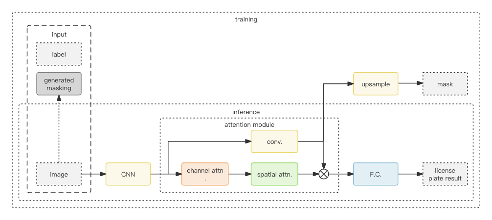

# Korean License Plate Recognition

This repository is based on [Self-supervised Implicit Glyph Attention for Text Recognition](https://arxiv.org/abs/2203.03382). It is a Tensorflow implementation of Korean license plate recognition.

## Demo

<a href="https://huggingface.co/spaces/noahzhy/KR_LPR_TF">
  
</a>


## Requirements

- Python 3.11.6
- Tensorflow 2.15.0
- numba
- numpy
- opencv-python
- Pillow

## Dataset

- Real Korean License Plate Dataset
- Synthetic Korean License Plate Dataset

## Training

```bash
python train.py
```

## Evaluation

```bash
python model/eval.py
```

## Model Architecture



## Model Performance

The best model saved in `./checkpoints/backup/best.keras`.

| task                      | accuracy  |
|:--------------------------|----------:|
| LPR w/ RE                 | 100.00 %  |
| LPR w/o RE                | 99.15 %   |
| Character Recognition     | 99.89 %   |

\* All accuracy is calculated on unquantized model

### Computational Cost

| task           | parameters | FLOPs       | size      |
|:--------------:|:----------:|:-----------:|:---------:|
| LPR deployment | 32,207     | 9.58 M      | 83 KB     |

### Speed of Inference

| task         | platform           | quantization | time    |
|:------------:|:-------------------|:------------:|--------:|
| LPR w/o RE   | Apple M2           | uint8        | 0.14 ms |
| LPR w/o RE   | Intel i9-10900K    | uint8        | - ms    |
| LPR w/o RE   | AMD EPYC 7V12      | uint8        | 0.42 ms |
| LPR w/o RE   | Coral Edge TPU     | uint8        | - ms    |

## One More Thing

The jax implementation of this repository is available at [here](./model/jax_model.py).
