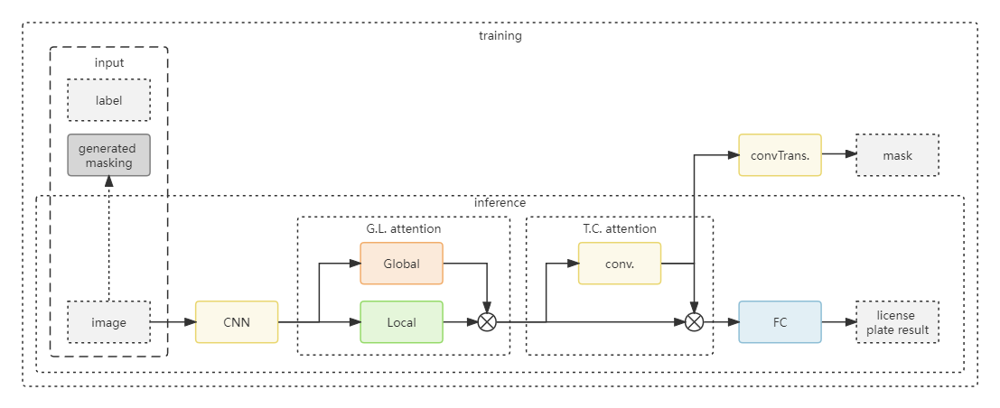
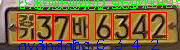
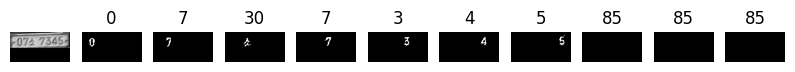
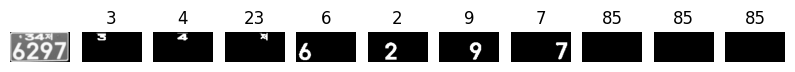
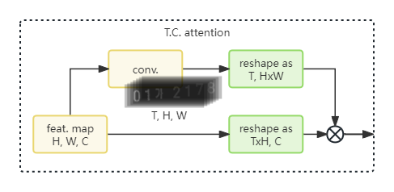
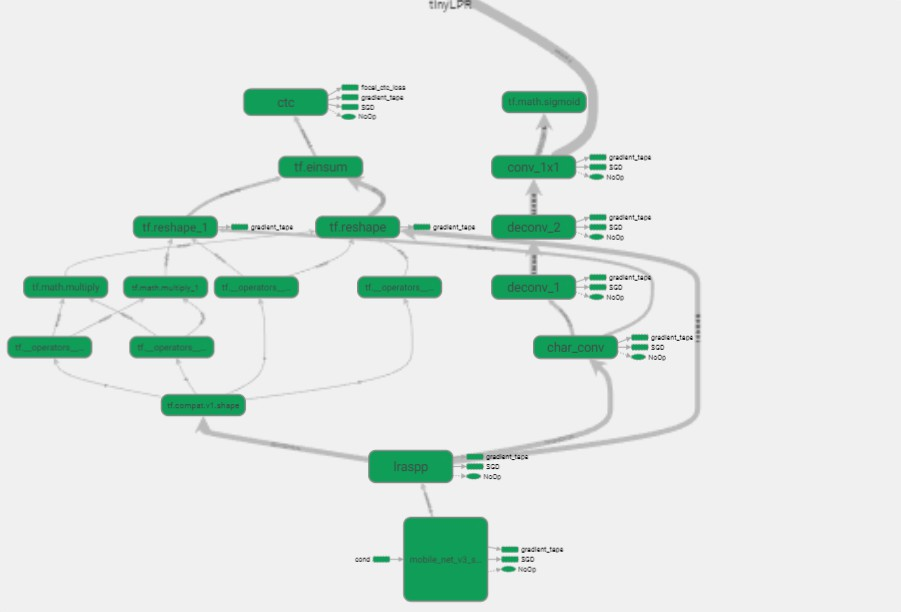
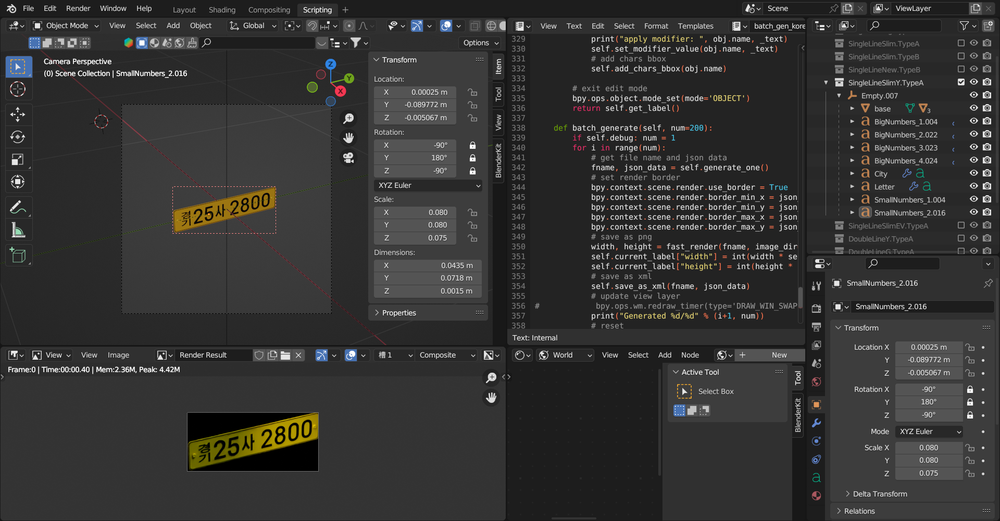
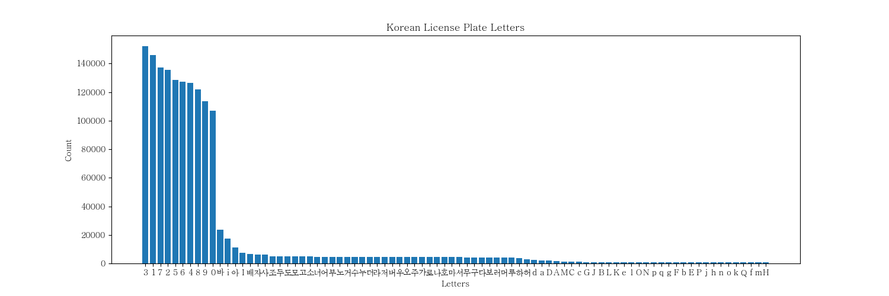

# Real-time Korean License Plate Recognition

## Abstract

With the development of multi-task learning in recent years, more and more experiments have proved that multi-task learning can further improve the accuracy. Compared with single-task learning, there are several advantages.

   1. Multi-task learning can obtain additional useful information by mining the relationship between tasks, and in most cases, the effect is better than that of single-task learning. In the case of less labeled samples, the single-task learning model often cannot learn enough information and performs poorly. Multi-task learning can overcome the current task with fewer samples, obtain useful information from other tasks, and learn better and more robust machine learning models.

   2. Multi-task learning has better model generalization ability. By simultaneously learning multiple related tasks, the shared model obtained can be directly applied to a related task in the future.

Inspired by this, the real-time South Korean license plate recognition model proposed in this project is a multi-task learning model. The model can simultaneously perform license plate number segmentation and license plate recognition tasks.

## Introduction

As shown in the figure below, the network is designed for multi-task learning, which includes two tasks: license plate numbers segmentation and license plate recognition. During training, the model generates segmentation results and license plate results at the same time, but in the actual deployment of the inference model, we remove the head responsible for the segmentation task to further simplify the model and improve the inference speed.



Although the char-level segmentation task is not the main task of this project, it can still improve the accuracy of license plate recognition. The model can learn the structure information of the license plate better, thereby improving the accuracy of license plate recognition.

Since the amount of data is large, we trained a simple license plate character object detection model to generate the bounding box of the license plate character, and then use simple opencv image processing operations to generate the corresponding character-level mask.

The object detection inference results are shown in the figure below.



In addition, the license plate recognition task is a sequence recognition task, and the order of the license plate characters is very important. Therefore, we reorder the license plate characters masks in the license plate according to the order of the license plate number. The another reason for this is there is two-row license plate in South Korea, and the order of the license plate characters is different from the one-row license plate, so we need to reorder the license plate characters masks to ensure the order of the license plate characters. The figure below shows the generated license plate character mask for single-row license plate and two-row license plate.





## Model

### Backbone

Considering the requirements of real-time, we use the lightweight model MobileNetV3 as the backbone network. The backbone network is used to extract the features of the input image. The backbone network is a MobileNetV3-Small model, which is a lightweight model with a small amount of calculation and a small number of parameters. The backbone network is used to extract the features of the input image. But we modify the mobileNetV3-Small model to make it more suitable for the license plate recognition task.

1. We change the input size of the model to 64x128, which is more suitable for the license plate recognition task. The few convolutional layers was changed to stride 1 to get bigger feature map to improve the accuracy of the model for the license plate recognition task.

    | #index | Operation      | Kernel Size | #out   | Stride |
    |:------:|:--------------:|:-----------:|:------:|:------:|
    | 0      | Conv           | 3x3         | 16     | 2      |
    | 1      | Bottleneck     | 3x3         | 16     | 2      |
    | 2      | Bottleneck     | 3x3         | 24     | 2->1   |
    | 3      | Bottleneck     | 3x3         | 24     | 1      |
    | 4      | Bottleneck     | 5x5         | 40     | 2      |
    | 5      | Bottleneck     | 5x5         | 40     | 1      |
    | ~~6~~  | ~~Bottleneck~~ | ~~5x5~~     | ~~40~~ | ~~1~~  |
    | 7      | Bottleneck     | 5x5         | 48     | 1      |
    | 8      | Bottleneck     | 5x5         | 48     | 1      |
    | 9      | Bottleneck     | 5x5         | 96->64 | 2->1   |
    | ~~10~~ | ~~Bottleneck~~ | ~~5x5~~     | ~~96~~ | ~~1~~  |
    | ~~11~~ | ~~Bottleneck~~ | ~~5x5~~     | ~~96~~ | ~~1~~  |

2. We remove the last two blocks of the original MobileNetV3-Small model and all SE blocks to reduce the amount of calculation and the number of parameters. Although the SE block can improve the accuracy of the model, it will also increase the amount of calculation and the number of parameters. Considering the requirements of real-time, we remove the SE block to reduce the amount of calculation and the number of parameters.

    | Blocks   | Latency (ms) |
    |:---------|:------------:|
    | Baseline | 1.53         |
    | + SE     | 2.10         |

3. Replaced hardswish with relu6 in the original MobileNetV3-Small model. The hardswish activation function is not supported by the coral device, and the relu6 activation function is more suitable for the coral device. The hardswish activation function and the relu6 activation function are shown below.

    Hard-swish activation function:

    $$ hard\_swish(x) = x * \frac{ReLU6(x + 3)}{6} $$

    ReLU6 activation function:

    $$ ReLU6(x) = min(max(0, x), 6) $$

    It is easy to find that the hardswish activation function is a linear combination of the relu6 activation function. Therefore, we replace the hardswish activation function with the relu6 activation function to make the model more suitable and less inference time on the coral device.

Though the above modifications, the model can be more suitable for the license plate recognition task and make sure the inference time could be less than 3 ms on the coral device.

### Attention Module

The attention module is constructed by local and global block. After extracting the features of the input image through the backbone network, the local block is used to locate the license plate area, and the global block is used to recognize the license plate characters.

For char module, using a simple 1x1 convolutional layer to get the character ordering sequence mask feature map and resize it to match the ordering of the license plate characters. Also, the feature map of attention module is resized to shape (batch_size, height x width, channel) to match the shape of the character ordering sequence mask feature map. Then, the feature map of attention module is multiplied by the character ordering sequence mask feature map to get the feature map of the license plate characters. After that, using a fully connected layer to get the license plate characters.



In order to further improve the accuracy and speed of the model, we use the focal CTC loss function to replace the traditional CTC loss function. The focal CTC loss function can reduce the impact of the uneven distribution of Korean characters and numbers on the model training.

$$ L_{Focal\ CTC} = \alpha * (1-y')^\gamma * \log(y'), $$

where $y'$ is the output of the model, $y$ is the target, $\alpha$ is the balance parameter, and $\gamma$ is the focusing parameter. In this project, $\alpha$ is set to 0.8 and $\gamma$ is set to 3.0.



As the figure above shows, the green node in above figure means the operation is supported by the coral device. All operations in license plate recognition model are supported in target coral device. The model is a lightweight model with a small amount of calculation and a small number of parameters, which can meet the requirements of real-time.

## Dataset

The distribution of license plate characters is very uneven, and the number of samples of some characters is very small. To solve this problem, we use Blender to model the license plate and generate a large number of license plate data that conforms to the actual situation. And considering the possible influence of the license plate frame lighting at night, we simulated it and finally generated a large number of synthetic license plate datasets.



The table below shows the number of samples of each dataset.

| Dataset      | Real     | Synthetic  | AI Hub  | Size    |
|:-------------|---------:|-----------:|--------:|--------:|
|Single-row    |15,132    |50,000      |70,059   |135,191  |
|Double-row    |2,852     |50,000      |8,729    |61,581   |
|Total         |17,984    |100,000     |78,788   |196,772  |

With the help of the synthetic dataset, we can train a more robust model. The figure below shows the distribution of the number of samples of each character in the synthetic dataset.



## Regular Expression

The RE means regular expression of which the format is `^[가-힣]{2}[0-9]{2}[가-힣]{1}[0-9]{4}|^[0-9]{2,3}[가-힣]{1}[0-9]{4}$`.

```python
def is_valid_label(label: list):
    # list to str
    label = ''.join(label)
    _city = [
        '서울', '부산', '대구', '인천', '광주',
        '대전', '울산', '세종', '경기', '강원',
        '충북', '충남', '전북', '전남', '경북',
        '경남', '제주',
    ]
    _pattern = r'^[가-힣]{2}[0-9]{2}[가-힣]{1}[0-9]{4}|^[0-9]{2,3}[가-힣]{1}[0-9]{4}$'
    # is valid
    if re.match(_pattern, label):
        return label[:2].isdigit() or label[:2] in _city
    else:
        return False
```

Any license plate that does not meet the above conditions is considered invalid.

## Model Performance

| task                      | accuracy* |
|:--------------------------|:---------:|
| LPR w/ RE                 | 100.0 %   |
| LPR w/o RE                | 99.10 %   |
| Character Recognition     | 99.88 %   |

\* All accuracy is calculated on unquantized model.

### Computational Cost

| task           | parameters | FLOPs       | size      |
|:---------------|:----------:|:-----------:|:---------:|
| LPR deployment | 32,207     | 9.57 M      | 83 KB     |

### Speed of Inference

| platform           | quantization | time*   | + decode | + RE    |
|:-------------------|:------------:|--------:|---------:|--------:|
| Apple M2           | uint8        | 0.14 ms | 0.17 ms  | 0.22 ms |
| Intel i9-10900K    | uint8        | 0.42 ms | 0.48 ms  | 0.55 ms |
| Coral Edge TPU     | uint8        | - ms    | - ms     | - ms    |

\* Only inference time is measured, not including the time of image preprocessing and postprocessing.

## Comparison with previous works

| work          | parameters | FLOPs      | model size    |  time   |
|:-------------:|-----------:|-----------:|--------------:|--------:|
| previous work | 1.93 M     | 332.7 M    | 684 KB        | 4 ms    |
| current work  | 0.32 M     |   9.6 M    |  83 KB        | - ms    |

\* All model is quantized to uint8 and tested on Intel i9-10900K@3.70GHz CPU platform.

## Development Environment

- Python 3.10.13
- Tensorflow 2.15.0
  * Tensorflow Lite v3 (runtime 2.3.0)
